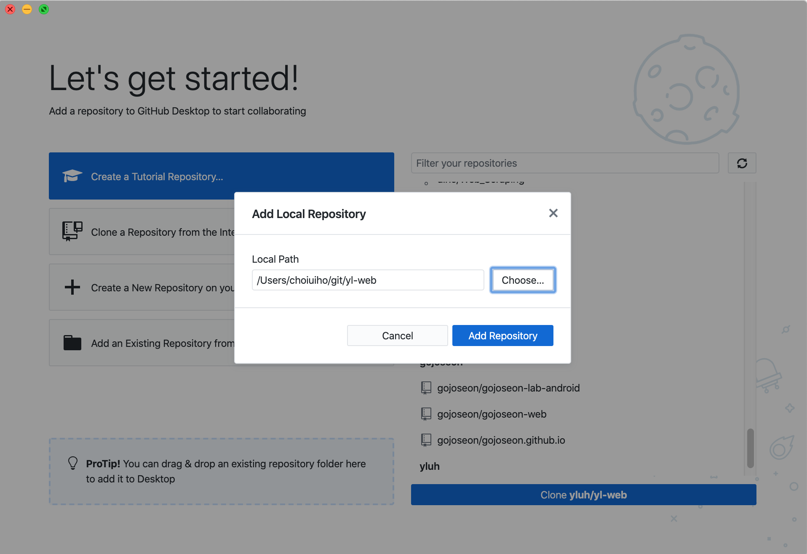
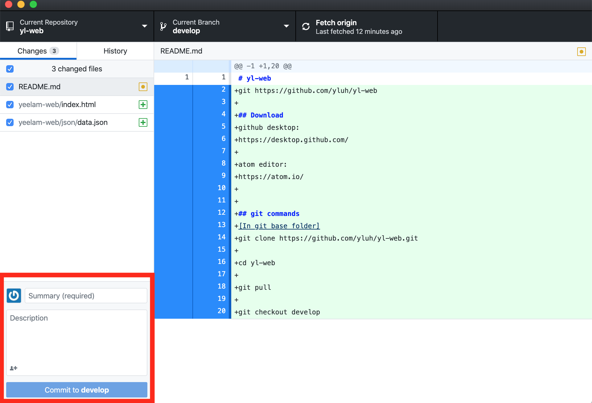
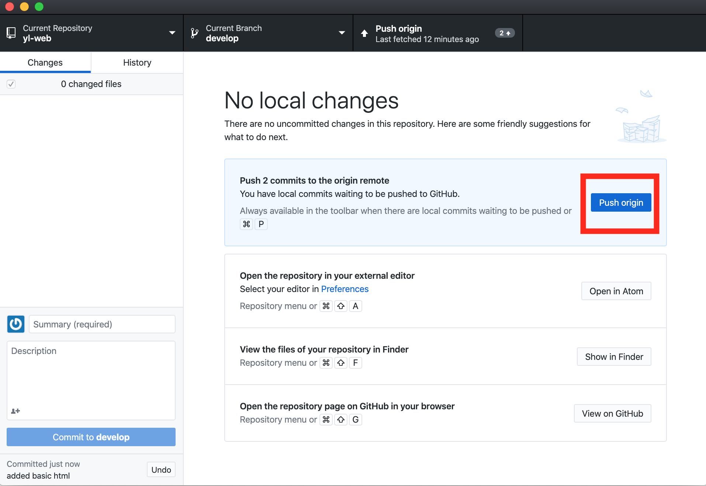
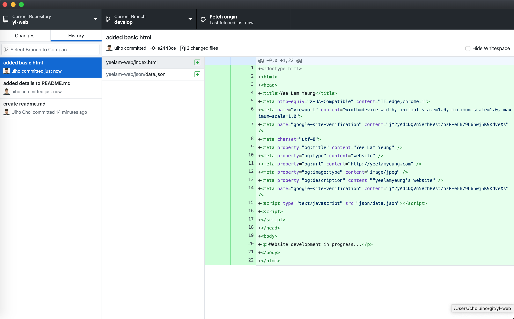

# yl-web
git https://github.com/yluh/yl-web

## Download
github desktop:
https://desktop.github.com/

atom editor:
https://atom.io/

## git commands
[In git base folder]
git clone https://github.com/yluh/yl-web.git

cd yl-web

git pull

git checkout develop

## Basic GitHub Desktop
Add local repository to github desktop

Select changes and commit with a message

Push your commit to remote server, github

Check your commit history

