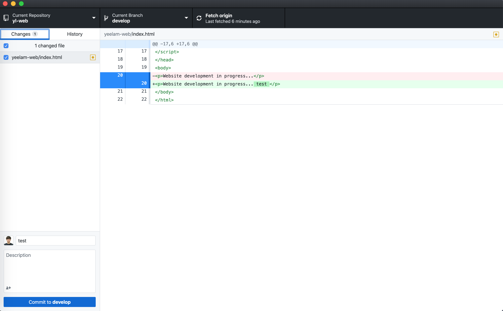
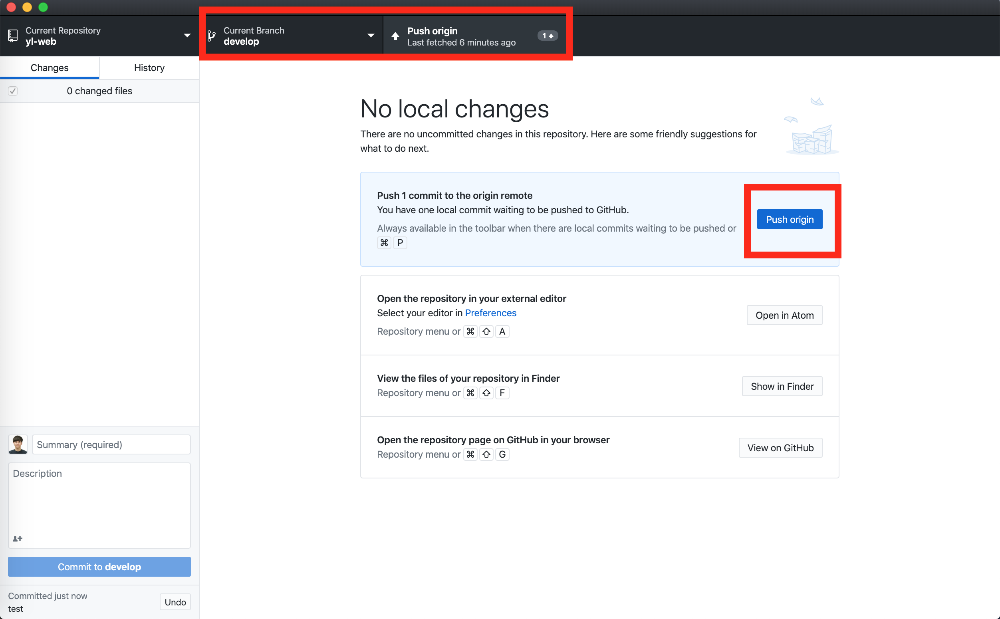
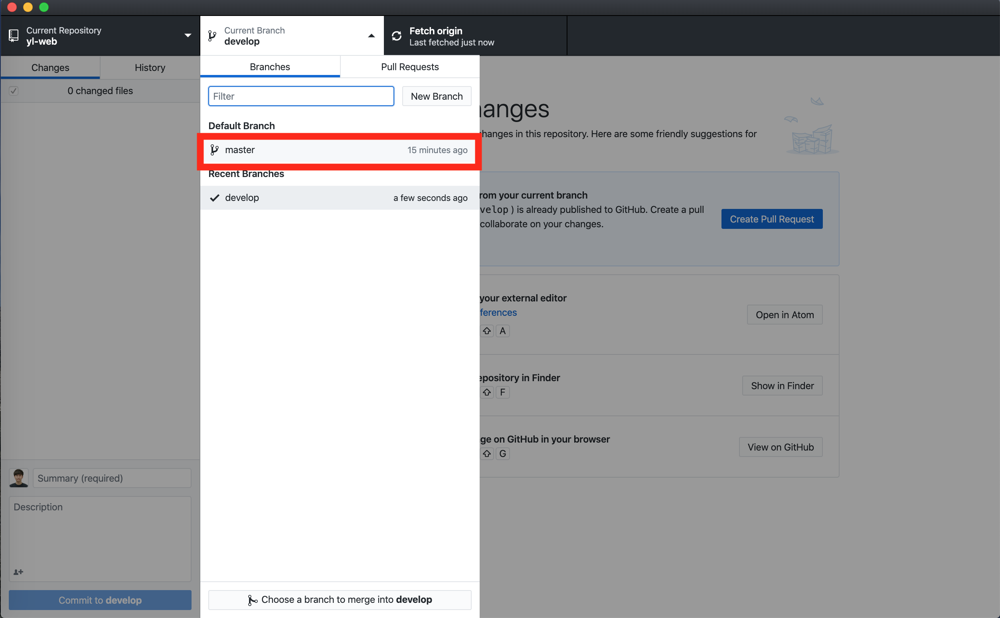
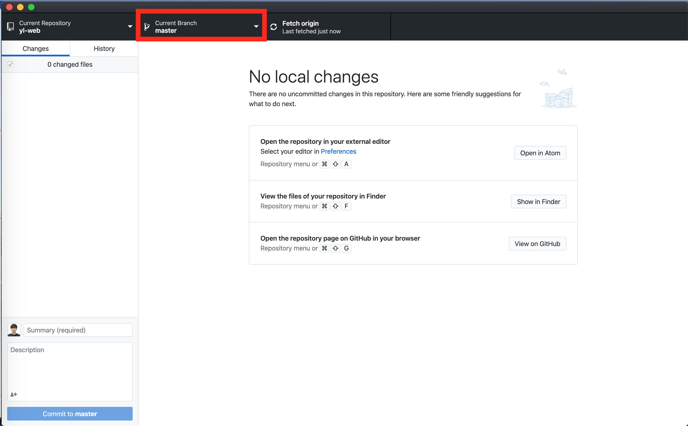
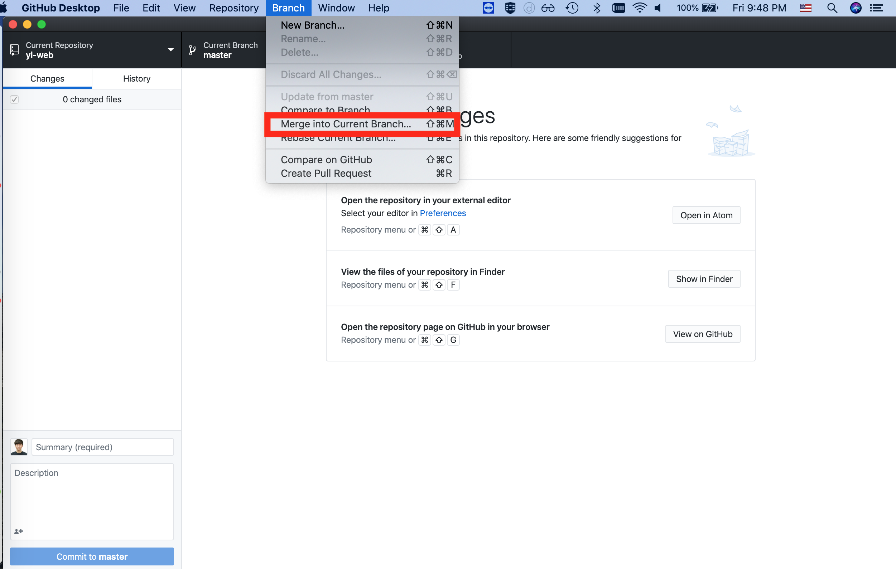
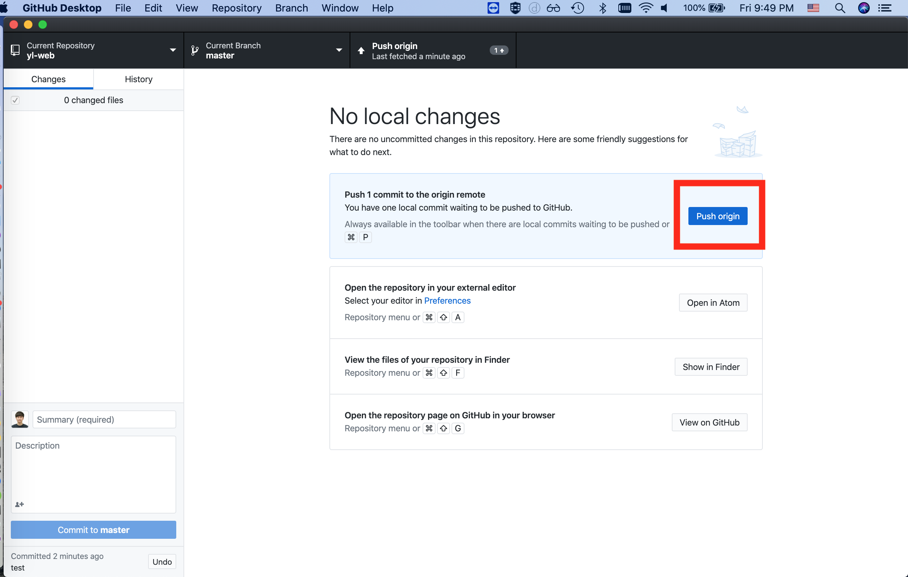

# yl-web
GitHub https://github.com/yluh/yl-web

GitHub Page:[See website changes]
https://yluh.github.io/yl-web/yeelam-web/index.html

## Download
github desktop:
https://desktop.github.com/

atom editor:
https://atom.io/

## git commands
[In git base folder]
git clone https://github.com/yluh/yl-web.git

cd yl-web

git pull

git checkout develop

## Basic GitHub Desktop
Add local repository to github desktop

Select changes and commit with a message

Push your commit to remote server, github

Check your commit history

### GitHub Desktop More
Add a test commit

Push origin

Change branch to master

Current branch master

Merge develop changes into master

master branch has develop changes now.

Push master branch to remote

